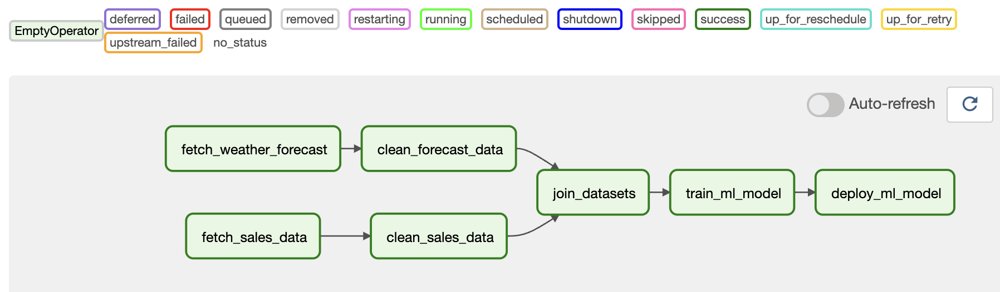
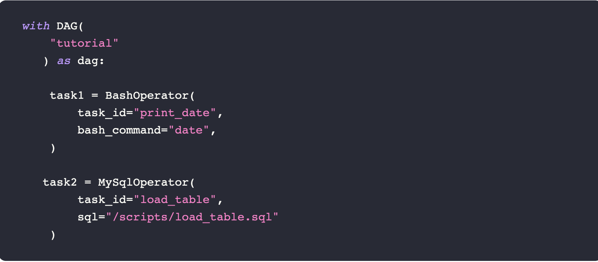

# Basic concepts of Airflow

In order to get started with Airflow, one has to be familiar with its main concepts, which can be a little tricky. So let’s try to demystify them.

## DAGs

All pipelines are defined as directed acyclic graphs (DAGs). Any time we execute a DAG, an individual run is created. Each DAG run is separate from another and contains a status regarding the execution stage of the DAG. This means that the same DAGs can be executed many times in parallel.


```python
dag = DAG(
    dag_id="01_umbrella",
    description="Umbrella example with DummyOperators.",
    start_date=airflow.utils.dates.days_ago(5),
    schedule_interval="@daily",
)
```



# Tasks

Each node of the DAG represents a Task, meaning an individual piece of code. Each task may have some upstream and downstream dependencies. These dependencies express how tasks are related to each other and in which order they should be executed. Whenever a new DAG run is initialized, all tasks are initialized as Task instances. This means that each Task instance is a specific run for the given task.

```python
fetch_weather_forecast = DummyOperator(task_id="fetch_weather_forecast", dag=dag)
fetch_sales_data = DummyOperator(task_id="fetch_sales_data", dag=dag)
clean_forecast_data = DummyOperator(task_id="clean_forecast_data", dag=dag)
clean_sales_data = DummyOperator(task_id="clean_sales_data", dag=dag)
join_datasets = DummyOperator(task_id="join_datasets", dag=dag)
train_ml_model = DummyOperator(task_id="train_ml_model", dag=dag)
deploy_ml_model = DummyOperator(task_id="deploy_ml_model", dag=dag)
```

# Operators

Operators can be viewed as templates for predefined tasks because they encapsulate boilerplate code and abstract much of their logic. Some common operators are `BashOperator`, `PythonOperator`, `MySqlOperator`, `S3FileTransformOperator`. As you can tell, the operators help you define tasks that follow a specific pattern. For example, the `MySqlOperator` creates a task to execute a SQL query and the BashOperator executes a bash script.



Operators are defined inside the DAG context manager as below. The following code creates two tasks, one to execute a bash command and one to execute a MySQL query.


# Task dependencies
To form the DAG’s structure, we need to define dependencies between each task. One way is to use the >> symbol as shown below:

```python
# Set dependencies between all tasks
fetch_weather_forecast >> clean_forecast_data
fetch_sales_data >> clean_sales_data
[clean_forecast_data, clean_sales_data] >> join_datasets
join_datasets >> train_ml_model >> deploy_ml_model

```