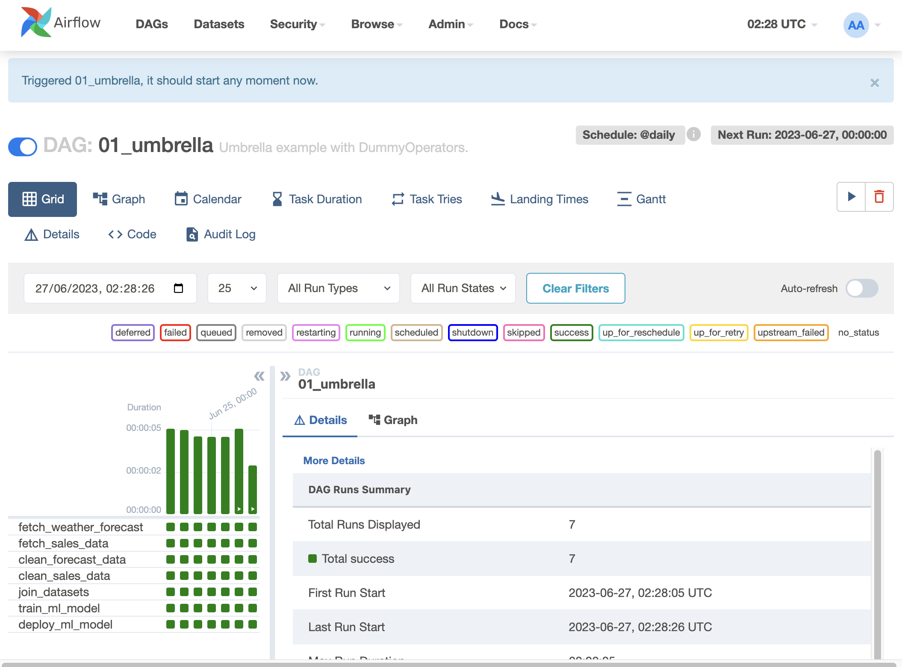

# Lab: Umbrella Use Case with Dummy Operators

## Introduction

This lab demonstrates an umbrella use case with dummy operators using Airflow. The use case involves a series of tasks representing a data pipeline for a hypothetical scenario. Each task is represented by a dummy operator, which serves as a placeholder for the actual work to be done.

## Steps
### Step 0: Start Airflow server
1. start file docker compose file docker-compose.yml
2. login into page http://localhost:8090/ with the user name airflow and password airlfow.

### Step 1: Set up the Airflow DAG

1. Open the Airflow web UI.
2. Create a new DAG named `01_umbrella`.
3. Set the following DAG properties:
   - Description: Umbrella example with DummyOperators.
   - Start Date: Select the appropriate start date for your lab
   - Schedule Interval: `@daily` (to run daily)

### Step 2: Define the tasks
- Define the following tasks using the `DummyOperator`:
   - `fetch_weather_forecast`: Represents fetching weather forecast data.
   - `fetch_sales_data`: Represents fetching sales data.
   - `clean_forecast_data`: Represents cleaning the weather forecast data.
   - `clean_sales_data`: Represents cleaning the sales data.
   - `join_datasets`: Represents joining the cleaned forecast and sales datasets.
   - `train_ml_model`: Represents training a machine learning model.
   - `deploy_ml_model`: Represents deploying the trained model.

### Step 3: Set task dependencies

- Set the dependencies between the tasks as follows:
   - `fetch_weather_forecast` >> `clean_forecast_data`
   - `fetch_sales_data` >> `clean_sales_data`
   - `clean_forecast_data`, `clean_sales_data` >> `join_datasets`
   - `join_datasets` >> `train_ml_model` >> `deploy_ml_model`

### Step 4: Save and Trigger the DAG (Directed Acyclic Graph)

1. Save the DAG configuration.
2. Trigger the DAG manually or wait for the scheduled time to start the data pipeline.

## Conclusion

In this lab, you learned how to create an Airflow DAG for an umbrella use case with dummy operators. Each task represents a step in a data pipeline, such as fetching data, cleaning data, joining datasets, training a machine learning model, and deploying the model. Dummy operators are used as placeholders for the actual work to be done in each step. You can use this lab as a starting point to build more complex data pipelines using Airflow.

