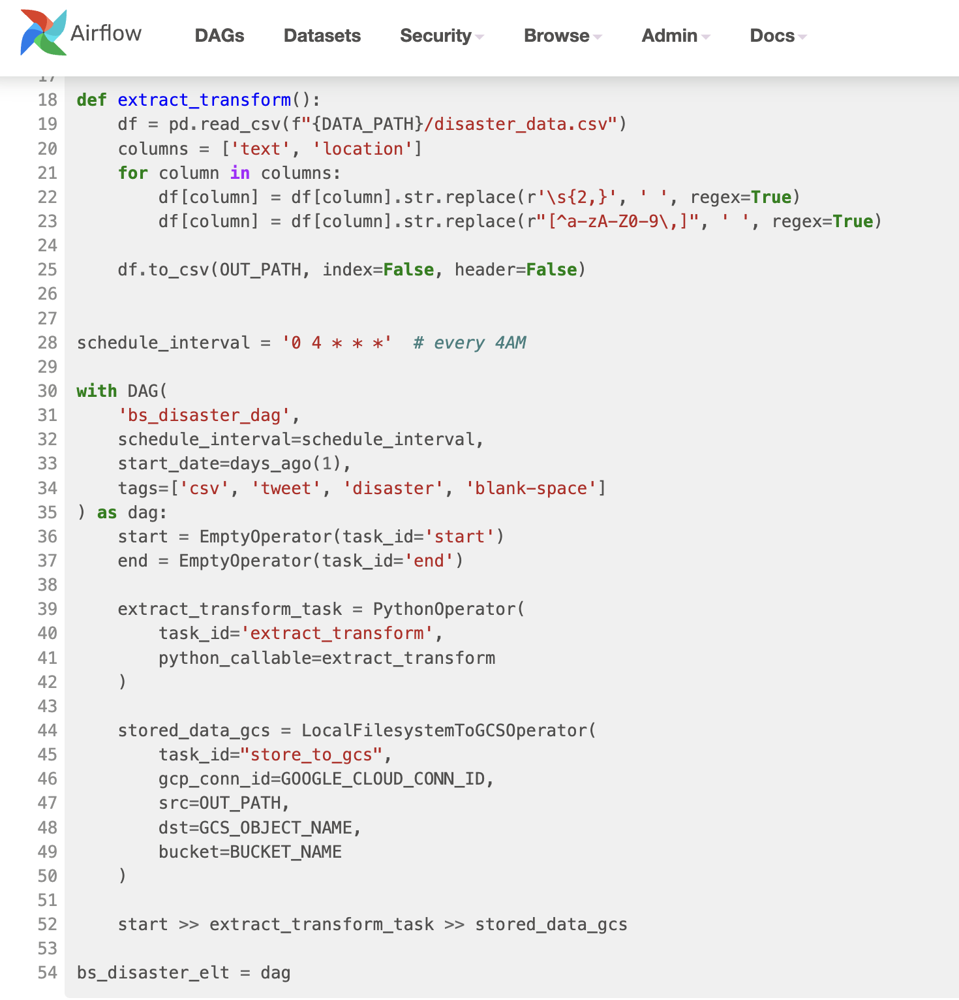

# Lab: BS Disaster ETL

## Introduction

This lab demonstrates an Extract-Transform-Load (ETL) process using Airflow. The ETL process involves extracting data from a CSV file, transforming it, and storing it in Google Cloud Storage (GCS).

## Prerequisites

Before starting this lab, make sure you have the following:

1. Airflow installed and configured.
2. Access to a Google Cloud Platform (GCP) project.
3. CSV file named `disaster_data.csv`.
4. Required variables configured in Airflow:
   - `BUCKET_NAME`: GCS bucket name for storing the extracted data.
   - `GOOGLE_CLOUD_CONN_ID`: Google Cloud connection ID for Airflow.

[Variable Configuration](./variables.json)

6. Verify connection between Google Cloud Platform (GCP) and Airflow.

## Steps

### Step 1: Set up the Airflow DAG

1. Open the Airflow web UI.
2. Create a new DAG named `bs_disaster_dag`.
3. Set the following DAG properties:
   - Schedule Interval: `0 4 * * *` (to run every day at 4 AM)
   - Start Date: Select the appropriate start date for your lab
   - Tags: `csv`, `tweet`, `disaster`, `blank-space`

### Step 2: Define the `extract_transform` task

1. Define a Python function named `extract_transform`.
2. Inside the function, read the CSV file `disaster_data.csv` using pandas.
3. Perform the necessary data transformations:
   - Clean the text and location columns by removing extra spaces and special characters.
4. Save the transformed data as a new CSV file named `extract_disaster_data.csv` in the `/opt/airflow/data` directory.

### Step 3: Define the tasks for storing the data

1. Define a task named `store_to_gcs` to store the transformed data in Google Cloud Storage (GCS).
   - Use the `LocalFilesystemToGCSOperator` to transfer the CSV file to GCS.
   - Set the source file path to the transformed CSV file created in the previous step.
   - Set the destination file name to `extract_disaster_data.csv`.
   - Set the GCS bucket name using the `BUCKET_NAME` variable.

### Step 4: Define the DAG structure

1. Define the start and end tasks as `EmptyOperator`.
2. Set the dependencies between the tasks as follows:
   - `start` >> `extract_transform` >> `store_to_gcs` >> `end`

### Step 5: Save and Trigger the DAG

1. Save the DAG configuration.
2. Trigger the DAG manually or wait for the scheduled time to start the ETL process.

### Step 6: Verify the content in Google Cloud Storage (GCS)

## Conclusion

In this lab, you learned how to create an Airflow DAG for the BS Disaster ETL process. The data was extracted from a CSV file, transformed, and stored in Google Cloud Storage (GCS). You can use this lab as a starting point for building more complex ETL pipelines using Airflow.

