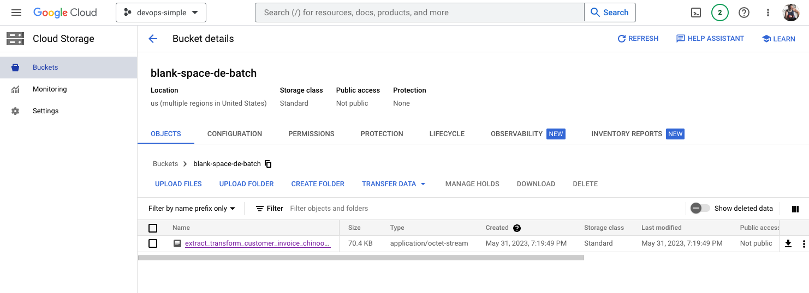
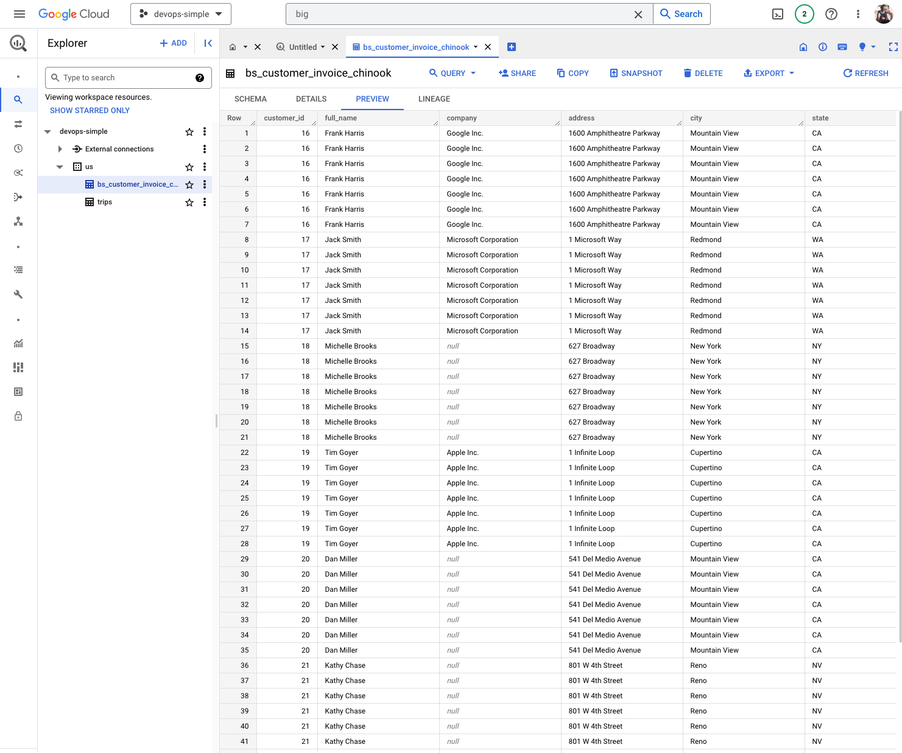

# Lab: BS Customer Invoice Chinook ETL

## Introduction

This lab demonstrates an Extract-Transform-Load (ETL) process using Airflow. The ETL process involves extracting data from a SQLite database, transforming it, and loading it into Google BigQuery. 

## Prerequisites

Before starting this lab, make sure you have the following:

1. Airflow installed and configured.
2. Access to a Google Cloud Platform (GCP) project.
3. SQLite database file named `chinook.db`.
4. Required variables configured in Airflow:
   - `DATASET_ID`: BigQuery dataset ID.
   - `BASE_PATH`: Base path for the lab project.
   - `BUCKET_NAME`: GCS bucket name for storing the extracted data.
   - `GOOGLE_CLOUD_CONN_ID`: Google Cloud connection ID for Airflow.

[variables.json](./variables.json)


## Steps

### Step 1: Set up the Airflow DAG

1. Open the Airflow web UI.
2. Create a new DAG named `bs_customer_invoice_chinook_dag`.
3. Set the following DAG properties:
   - Owner: `okza`
   - Email: `datokza@gmail.com`
   - Email on Failure: `True`
   - Schedule Interval: `0 4 * * *` (to run every day at 4 AM)
   - Start Date: Select the appropriate start date for your lab
   - Tags: `sqlite`, `blank-space`, `music`

### Step 2: Define the `extract_transform` task

1. Define a Python function named `extract_transform`.
2. Inside the function, establish a connection to the SQLite database `chinook.db`.
3. Read the SQL query from the file `chinook.sql`.
4. Execute the query and retrieve the data as a Pandas DataFrame.
5. Save the DataFrame as a CSV file named `extract_transform_customer_invoice_chinook.csv` in the `data` directory.

### Step 3: Define the tasks for storing and loading the data

1. Define a task named `store_to_gcs` to store the extracted data in Google Cloud Storage (GCS).
   - Use the `LocalFilesystemToGCSOperator` to transfer the CSV file to GCS.
   - Set the source file path to the CSV file created in the previous step.
   - Set the destination file name to `extract_transform_customer_invoice_chinook.csv`.
   - Set the GCS bucket name using the `BUCKET_NAME` variable.


   

2. Define a task named `load_to_bigquery` to load the data from GCS to BigQuery.
   - Use the `GCSToBigQueryOperator` to load the data from GCS to BigQuery.
   - Set the GCS bucket name using the `BUCKET_NAME` variable.
   - Set the source object as `extract_transform_customer_invoice_chinook.csv`.
   - Set the destination project dataset table using the `DATASET_ID` and `BIGQUERY_TABLE_NAME` variables.
   - Define the schema fields for the destination table.
   
   

   

### Step 4: Define the DAG structure

1. Define the start and end tasks as `DummyOperator`.
2. Set the dependencies between the tasks as follows:
   - `start` >> `extract_transform` >> `store_to_gcs` >> `load_to_bigquery` >> `end`

### Step 5: Save and Trigger the DAG

1. Save the DAG configuration.
2. Trigger the DAG manually or wait for the scheduled time to start the ETL process.

## Conclusion

In this lab, you learned how to create an Airflow DAG for the BS Customer


```python
import sqlite3
import pandas as pd
from datetime import datetime

from airflow.decorators import dag, task
from airflow.utils.dates import days_ago
from airflow.models.variable import Variable
from airflow.operators.dummy import DummyOperator
from airflow.providers.google.cloud.transfers.local_to_gcs import LocalFilesystemToGCSOperator
from airflow.providers.google.cloud.transfers.gcs_to_bigquery import GCSToBigQueryOperator


BASE_PATH = Variable.get('BASE_PATH')
GOOGLE_CLOUD_CONN_ID = Variable.get("GOOGLE_CLOUD_CONN_ID")
BUCKET_NAME = Variable.get('BUCKET_NAME')
DATASET_ID = Variable.get("DATASET_ID")

GOOGLE_OBJECT_NAME = "extract_transform_customer_invoice_chinook.csv"
INPUT_OBJECT_NAME = "chinook.db"
SQL_FILE = "chinook.sql"


DATA_PATH = f"{BASE_PATH}/data"
SQL_PATH = f"{BASE_PATH}/sql"
OUT_PATH = f"{BASE_PATH}/data/{GOOGLE_OBJECT_NAME}"


GCS_OBJECT_NAME = "extract_transform_customer_invoice_chinook.csv"
BIGQUERY_TABLE_NAME = "bs_customer_invoice_chinook"


@dag(
    default_args={
        'owner': 'okza',
        'email': 'datokza@gmail.com',
        'email_on_failure': True
    },
    schedule_interval='0 4 * * *',
    start_date=days_ago(1),
    tags=['sqlite', 'music']
)
def bs_customer_invoice_chinnook_dag():

    start = DummyOperator(task_id='start')
    end = DummyOperator(task_id = 'end')

    @task()
    def extract_transform():
        print("extract transform")
        conn = sqlite3.connect(f"{DATA_PATH}/{INPUT_OBJECT_NAME}")
        with open(f"{SQL_PATH}/{SQL_FILE}") as query:
            df = pd.read_sql(query.read(), conn)
        df.to_csv(OUT_PATH, index=False, header=False)
    
    extract_transform_data = extract_transform()
    now = datetime.now()


    store_data_gcs = LocalFilesystemToGCSOperator(
        task_id = 'store_data_gcs',
        gcp_conn_id = GOOGLE_CLOUD_CONN_ID,
        src = OUT_PATH,
        dst = GCS_OBJECT_NAME,
        bucket=BUCKET_NAME
    )

    load_data_bigquery = GCSToBigQueryOperator(
        task_id = 'load_data_bigquery',
        bucket=BUCKET_NAME,
        source_objects=[GCS_OBJECT_NAME],
        destination_project_dataset_table=f"{DATASET_ID}.{BIGQUERY_TABLE_NAME}",
        schema_fields=[ #based on https://cloud.google.com/bigquery/docs/schemas
            {'name': 'customer_id', 'type': 'INT64', 'mode': 'REQUIRED'},
            {'name': 'full_name', 'type': 'STRING', 'mode': 'NULLABLE'},
            {'name': 'company', 'type': 'STRING', 'mode': 'NULLABLE'},
            {'name': 'address', 'type': 'STRING', 'mode': 'NULLABLE'},
            {'name': 'city', 'type': 'STRING', 'mode': 'NULLABLE'},
            {'name': 'state', 'type': 'STRING', 'mode': 'NULLABLE'},
            {'name': 'country', 'type': 'STRING', 'mode': 'NULLABLE'},
            {'name': 'postal_code', 'type': 'STRING', 'mode': 'NULLABLE'},
            {'name': 'phone', 'type': 'STRING', 'mode': 'NULLABLE'},
            {'name': 'fax', 'type': 'STRING', 'mode': 'NULLABLE'},
            {'name': 'email', 'type': 'STRING', 'mode': 'NULLABLE'},
            {'name': 'invoice_id', 'type': 'INT64', 'mode': 'NULLABLE'},
            {'name': 'invoice_date', 'type': 'DATE', 'mode': 'NULLABLE'},
            {'name': 'billing_address', 'type': 'STRING', 'mode': 'NULLABLE'},
            {'name': 'billing_city', 'type': 'STRING', 'mode': 'NULLABLE'},
            {'name': 'billing_state', 'type': 'STRING', 'mode': 'NULLABLE'},
            {'name': 'billing_country', 'type': 'STRING', 'mode': 'NULLABLE'},
            {'name': 'billing_postal_code', 'type': 'STRING', 'mode': 'NULLABLE'},
            {'name': 'total', 'type': 'FLOAT64', 'mode': 'NULLABLE'},
        ], 
        autodetect=False,
        write_disposition='WRITE_TRUNCATE', #If the table already exists - overwrites the table data
    )


    start >> extract_transform_data 
    extract_transform_data >> store_data_gcs
    store_data_gcs >> load_data_bigquery
    load_data_bigquery >> end

bs_customer_invoice_chinook_etl = bs_customer_invoice_chinnook_dag()
```