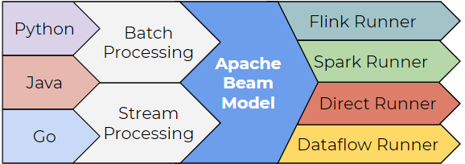

# Why and when should I consider Apache Beam

## What is Apache Beam?
- Apache Beam is an open-source, unified model for defining both batches as well as streaming data-parallel processing pipelines.
- Moreover available open-source Beam SDKs, can help us to easily build a program for our pipeline.
- Apache Flink, Apache Spark, and Cloud DataFlow are some of the possible runners to run the program.

## Why use Apache Beam?

- Data Engineers mostly used Beam so as to create Extract,Transform and Load (ETL) tasks and for Data Integration.
- It is also useful in embracing parallel data processing tasks.
- In data processing tasks, the problem decompose into smaller chunks and processed independently, in other words we are running Map-Reduce jobs.
- As a result,Apache Beam achieves parallel processing.

## Features of Apache Beam
- `Unified` – Single Programming for Batch + Streaming
- `Extensible` – Write and Share new SDKs,IO connectors and - transformation libraries.
- `Portable` – Exectues pipelines on mutiple execution environment,
- `Open Source `– Community Based Developement

## Apache Beam Pipeline Runners
- Firstly, all we will need an appropriate runner for the backend.
- They translate the data processing pipeline into API compatible with the backend of User’s choice.
- This features helps Beam to provide a protable Programming Layers.
- Currently Beam Supports following runners:
    - Direct Runner
    - Flink Runner
    - Nemo Runner
    - Samza Runner
    - Spark Runner
    - Google Cloud DataFlow Runner
    - HazelCast Jet Runner
    - Twitser2 Runner