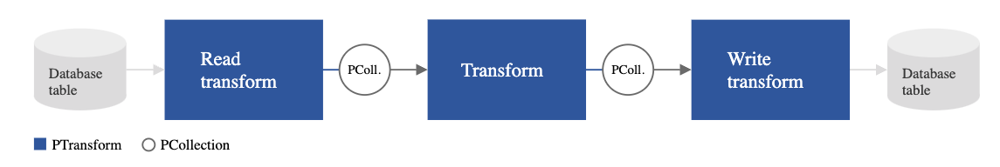
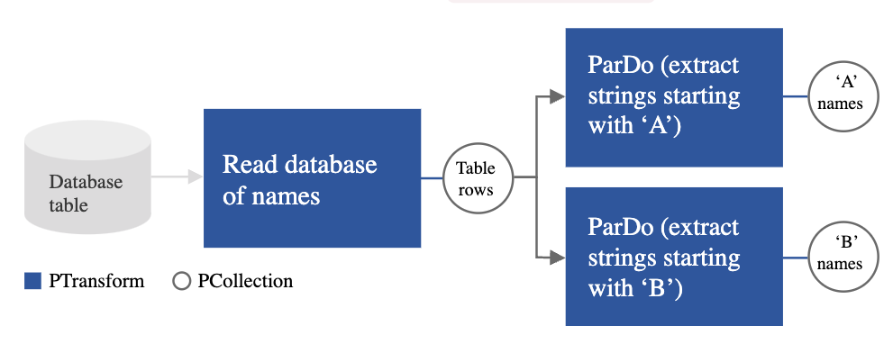
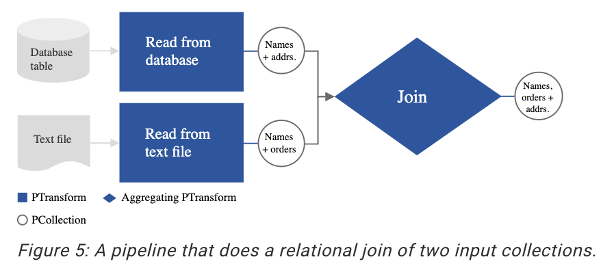

# Basic Concepts of Apache Beam

Apache Beam is a unified programming model and framework for building batch and streaming data processing pipelines. It provides a set of high-level APIs that allow developers to express data processing logic in a portable and scalable manner. This document introduces some of the basic concepts of Apache Beam.

## Pipeline

- A pipeline represents the entire data processing workflow.
- It consists of a series of transformations and operations that are applied to data.
- Pipelines are constructed using the Apache Beam SDK and can be executed on various distributed processing backends.

## PCollection

- A PCollection (Parallel Collection) is the fundamental data abstraction in Apache Beam.
- It represents a distributed dataset that flows through the pipeline.
- PCollections can be created from different data sources, such as files, databases, or external systems.

## PTransform

- Transformations are operations applied to PCollections to process and transform the data.
- They can include operations like filtering, mapping, aggregating, combining, or joining data.
- Transformations can be chained together to form complex data processing pipelines.

## ParDo

- ParDo is a type of transformation that applies a user-defined function (DoFn) to each element in a PCollection.
- It allows for element-wise processing and can produce zero, one, or multiple output elements for each input element.

## GroupByKey and Combine

- GroupByKey is a transformation that groups elements in a PCollection by key, resulting in key-value pairs.
- Combine is a transformation that performs aggregations on key-value pairs within a PCollection.
- It allows for efficient data aggregation and reduction operations, such as summing or finding the maximum value.

## I/O Connectors

- Apache Beam supports a wide range of I/O connectors for reading and writing data from different sources and sinks.
- Examples include reading from and writing to files, databases, message queues, and cloud storage systems.
- I/O connectors provide integration with external systems and enable data ingestion and export in the pipelines.

## Runners

- Runners are responsible for executing the data processing pipelines on various execution environments.
- Apache Beam supports multiple runners, including local runners for development and testing, as well as distributed runners for production deployments.
- Runners interact with the underlying processing engines, such as Apache Flink, Apache Spark, or Google Cloud Dataflow.

These are some of the basic concepts of Apache Beam. Understanding these concepts is essential for building data processing pipelines using Apache Beam and leveraging its capabilities for scalable and portable data processing.
