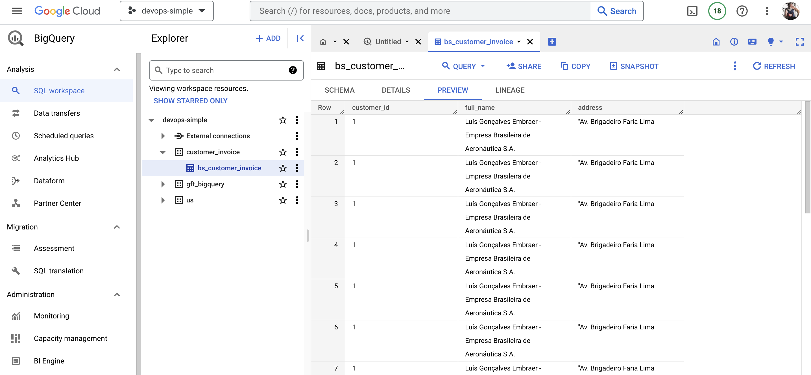

# Example Full workflow Arflow, Apache Beam and Google Cloud Platform (GCP)


To implement Full workflow Arflow, Apache Beam and Google Cloud Platform (GCP), follow the steps below:

## Step 1: Set up environment variables

```bash
export PROJECT_ID="devops-simple"
export BUCKET_NAME="gft-demo-gcs-bucket"
export REGION="us-central1"
```

## Step 2: Copy the department data file to a Google Cloud Storage bucket and Create a template for the attendance job


```bash

gsutil cp airflow/data/extract_transform_customer_invoice.csv gs://${BUCKET_NAME}/input/extract_transform_customer_invoice.csv

python3 pipline/pipline-invoice.py 

```


## Step 3: Execute the DAG bs_customer_invoice_dag to extract data to bigQuery 


