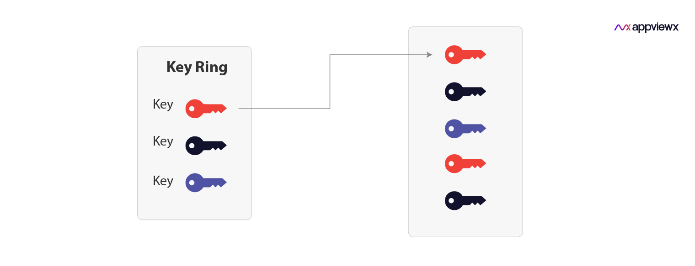

# Hello Keyring and Key in Google KMS 

In Google Cloud Key Management Service (KMS), a keyring and a key are two important concepts related to managing cryptographic keys securely. Let's understand what each of them represents:

- **Keyring**: A keyring is a logical container or a grouping mechanism within Google KMS. It acts as a namespace for keys and helps you organize and manage keys based on your requirements. You can think of a keyring as a folder that holds multiple keys. Keyrings provide a way to group keys by project, team, application, or any other logical grouping you prefer.

- **Key**: A key represents a cryptographic key that is used for various purposes, such as encrypting or decrypting data, signing or verifying digital signatures, or generating other cryptographic keys. In Google KMS, keys are stored and managed within keyrings. Each key has its own set of properties, permissions, and associated metadata. Keys within a keyring can be versioned, allowing you to rotate keys or manage key lifecycle easily.

Using keyrings and keys in Google KMS allows you to separate and control access to different cryptographic keys and provides a centralized way to manage and secure your keys across different projects and applications within Google Cloud Platform.





To implement the Google Cloud Key Management Service (KMS) based on your commands, you can follow the steps below:


## Create a keyring:

``` bash
gcloud kms keyrings create keyring-devops-simple --location global
```

## Create a key within the keyring:

``` bash
gcloud kms keys create key-devops-simple --keyring keyring-devops-simple --location global --purpose encryption
```

## List out keyrings and keys

``` bash
gcloud kms keyrings list --location global
```

## List the keys within a specific keyring:
``` bash
KEYRING_NAME=keyring-devops-simple
LOCATION=global

gcloud kms keys list --keyring $KEYRING_NAME --location $LOCATION
```

## Encrypt a file using the created key:

``` bash
KEYRING_NAME=keyring-devops-simple
LOCATION=global
KEY_NAME=key-devops-simple

gcloud kms encrypt --key $KEY_NAME --keyring $KEYRING_NAME --location $LOCATION --plaintext-file=department-data.txt --ciphertext-file=ciphertext-department-data.txt

```

## Decrypt the encrypted file:

``` bash
KEYRING_NAME=keyring-devops-simple
LOCATION=global
KEY_NAME=key-devops-simple

gcloud kms decrypt --key $KEY_NAME --keyring $KEYRING_NAME --location $LOCATION --plaintext-file=decrypted.txt --ciphertext-file=ciphertext-department-data.txt
```

Make sure you have the necessary permissions and the Cloud SDK (gcloud) installed and properly configured before running these commands. Adjust the variables (KEYRING_NAME, LOCATION, KEY_NAME) as needed to match your setup.


