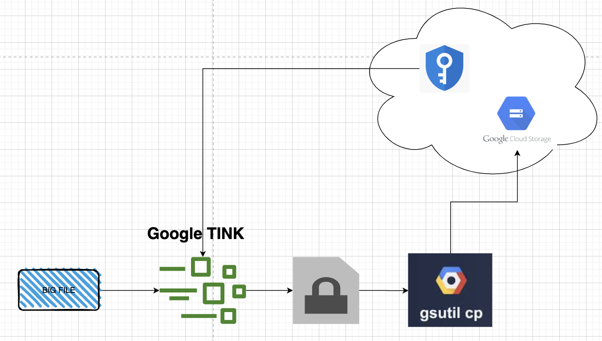
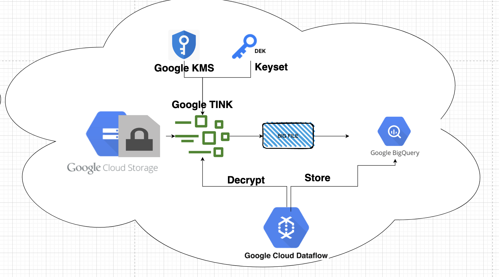

# Apply Tink Streaming To Client Source

##  1) GCP etlserver

This document provides step-by-step instructions on how to encrypt a file and upload it to a cloud storage bucket using Google Cloud Storage and Google Cloud KMS (Key Management Service).





[Download Source](https://gft365-my.sharepoint.com/:u:/g/personal/kany_gft_com/EZt_kT4xVutClyZ2gSmnbbYB-inFkVHHcfPUex-tha_WIA?e=jLT2qn)

### a) Set Up Active Environment

Before proceeding with encryption and upload, make sure you have the necessary environment set up. The following commands create a virtual Python environment, activate it, and install the required Python packages.

```bash
# Create virtual Python environment
python3.8 -m venv .venv

# Activate virtual Python environment
. .venv/bin/activate

# Install Python requirements
#   Ignore expected warning: 'WARNING: You are using pip version 19.3.1; however, version 22.2.2 is available.'
python3.8 -m pip install -r requirements.txt
```


### b) Encrypt the File and Upload to Cloud Storage
Now, let's encrypt the file and upload it to a Google Cloud Storage bucket. The encryption will be performed using Google Cloud KMS for added security.

Example Bash commands for encryption and upload:


```bash

# Set the required environment variables (Update these values accordingly)
source ~/.bashrc
export SERVICE_ACCOUNT_KEY_PATH=$GOOGLE_APPLICATION_CREDENTIALS
export PROJECT_ID="devops-simple"
export BUCKET_NAME="108-demo-gsutil"
export REGION="global"
export KEYRING_NAME=keyring-devops-simple
export LOCATION=global
export KEY_NAME=key-devops-simple
export FILE_NAME=mcifreference.dat.gz
export TEST_UPLOAD_FILE_NAME_1="data/$FILE_NAME"
export BUCKET_FILE_NAME="stream-$FILE_NAME"

# Upload encrypted file (using wrapped gsutil)
./gsutil cp --client_side_encryption=gcp-kms://projects/${PROJECT_ID}/locations/${REGION}/keyRings/${KEYRING_NAME}/cryptoKeys/${KEY_NAME},${SERVICE_ACCOUNT_KEY_PATH} "${TEST_UPLOAD_FILE_NAME_1}" gs://${BUCKET_NAME}/${BUCKET_FILE_NAME}
```

### c) Decrypt the Downloaded File
To decrypt the downloaded file, you need to use a decryption script that utilizes the Google Cloud KMS for decryption. Ensure that you have the required permissions and configurations for decryption.

Example Bash commands to run the decryption script:

```bash
# Set the required environment variables (Update these values accordingly)
source ~/.bashrc
export SERVICE_ACCOUNT_KEY_PATH=$GOOGLE_APPLICATION_CREDENTIALS
export PROJECT_ID="devops-simple"
export KEYRING_NAME=keyring-devops-simple
export KEY_NAME=key-devops-simple
export REGION="global"
export FILE_NAME=mcifreference.dat.gz
export TEST_DOWNLOAD_FILE_NAME_1_ENCRYPTED="data/download_stream-$FILE_NAME"
export PYTHONPATH="${PYTHONPATH}:/Users/kany/project-local/data-home/tranning-Airflow/303.03-encription-descript-wrapper"
export INPUT_FILEPATH="/Users/kany/.gsutil-wrapper/T73PK6Cz/stream_mcifreference.dat.gz"

# Run the testing script which decrypts the data
python3.8 testing/test_stream_decrypt.py \
--kek_uri=gcp-kms://projects/${PROJECT_ID}/locations/${REGION}/keyRings/${KEYRING_NAME}/cryptoKeys/${KEY_NAME} \
--sa_path=${SERVICE_ACCOUNT_KEY_PATH} \
--input_filepath=${INPUT_FILEPATH} \
--output_filepath=${TEST_DOWNLOAD_FILE_NAME_1_ENCRYPTED}

```

##  2) GCP ingestion

This guide provides step-by-step instructions on how to run a data load using Google Cloud Dataflow. The data load involves processing and loading data from an interface file into a target BigQuery table, while also encrypting the data for added security.





### a) Initialize Environment

Before running the data load, you need to set up your Python environment and install the required packages.

```bash
# Activate virtual Python environment
. .venv/bin/activate

# Install Python requirements
pip install -r requirements.txt
```

### b) Run Data Load of Given Interface File
To run the data load for a given interface file, follow the steps below. Ensure you have the necessary configurations and permissions set up in Google Cloud Platform.


```python
source ~/.bashrc
export SERVICE_ACCOUNT_KEY_PATH=$GOOGLE_APPLICATION_CREDENTIALS
export PROJECT_ID="devops-simple"
export BUCKET_NAME="108-demo-gsutil"
export REGION="global"
export KEYRING_NAME=keyring-devops-simple
export KEY_NAME=key-devops-simple
export FILE_NAME="bg3_acct_float"

python main.py \
--temp_location=gs://${BUCKET_NAME}/dataflow \
--source_filename_pattern=gs://108-demo-gsutil/stream-encrypt/bg3_acct_float.dat.20361002.gz \
--filename=${FILE_NAME} \
--target_table_name=690166640928:gft_bigquery.${FILE_NAME} \
--encoding=ascii \
--batch_date=20361002 \
--validation_method=verify_1n2 \
--kek_uri=gcp-kms://projects/${PROJECT_ID}/locations/${REGION}/keyRings/${KEYRING_NAME}/cryptoKeys/${KEY_NAME} \
--load_type=full \
--sys_code=CIS

```

