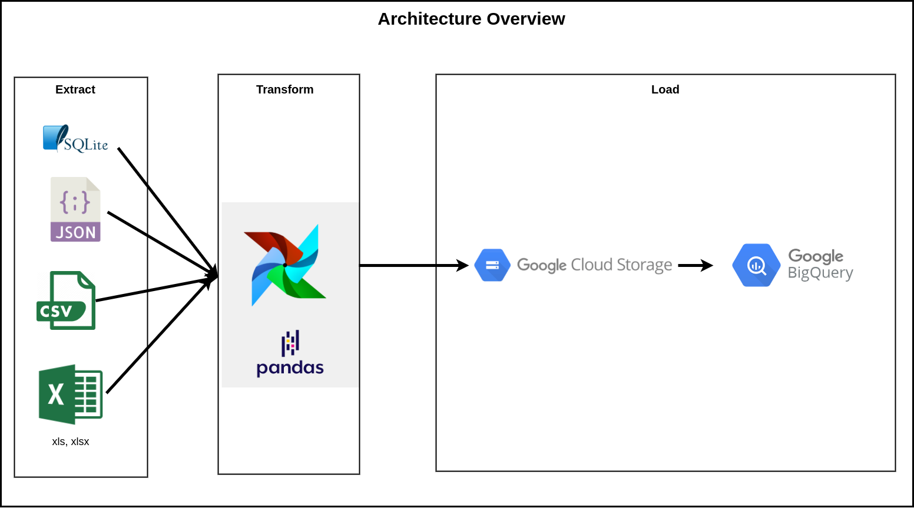

# Learning Path: Technical ETL, Airflow, GCP, BigQuery, Kafka in Banking Domain

## Airflow:

### 1. Hello Ariflow Lab
- [Install Airflow](./00-install/install.md)
- [Hello Airflow](./00-install/hello.md)

### 2. [Connect Arflow with GPC](./02-gpc/02-gpc.md)

### 3. [Connect Arflow with GPC and store data into BigQuery](./03-gpc-bigquery/03-gpc-bigquery.md)

## Apache Beam:
